# Linear Algebra MicroSims

A collection of 126 interactive educational MicroSimulations 
for learning Applied Linear Algebra for AI and Machine Learning.

## Vectors and Basic Operations

- **[2D/3D Vector Visualizer](./vector-2d-3d-visualizer/index.md)**

    
    Interactive visualization of vectors in 2D and 3D coordinate systems with adjustable components, projection lines, and component labels.

- **[Vector Operations Playground](./vector-operations-playground/index.md)**

    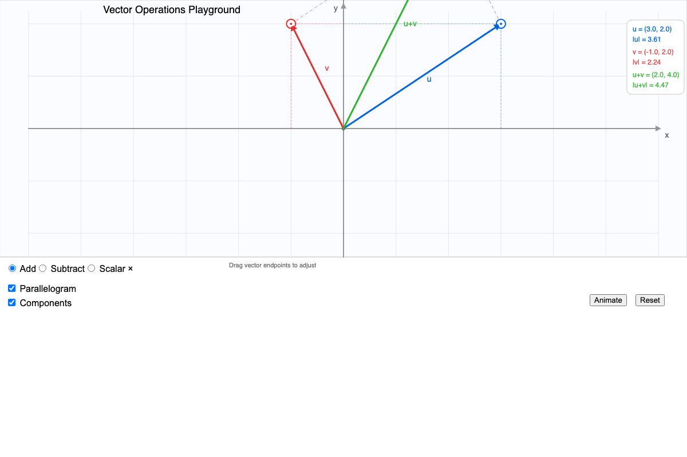
    Interactive visualization of vector addition, subtraction, and scalar multiplication with draggable vectors and geometric constructions.

- **[Row and Column Vectors](./row-column-vectors/index.md)**

    
    Interactive visualization comparing row vectors (horizontal, 1×n) and column vectors (vertical, m×1) to help students understand how orientation affects matrix operations.

- **[Norm Comparison Visualizer](./norm-comparison-visualizer/index.md)**

    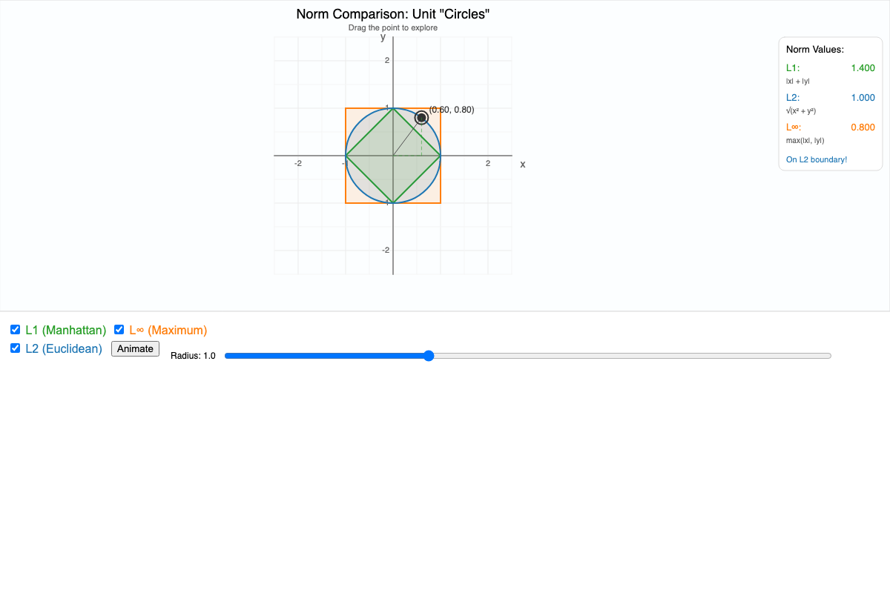
    Interactive visualization comparing L1 (Manhattan), L2 (Euclidean), and L-infinity (Maximum) norms through their unit shapes and distance measurements.

- **[Dot and Cross Product](./dot-cross-product-visualizer/index.md)**

    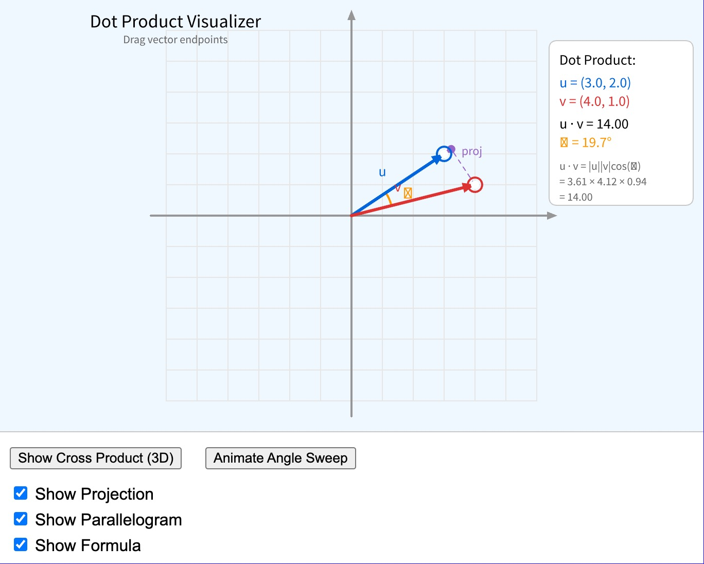
    Interactive visualization comparing dot product (projection and angle) with cross product (perpendicular vector and parallelogram area).

- **[Linear Combination Explorer](./linear-combination-explorer/index.md)**

    
    Interactive visualization of linear combinations with adjustable coefficients, target challenges, and span visualization.

## Vector Spaces

- **[Vector Space Axiom Explorer](./vector-space-axiom-explorer/index.md)**

    
    Interactive infographic for exploring the ten vector space axioms with hover definitions and concrete examples.

- **[Vector Space Gallery](./vector-space-gallery/index.md)**

    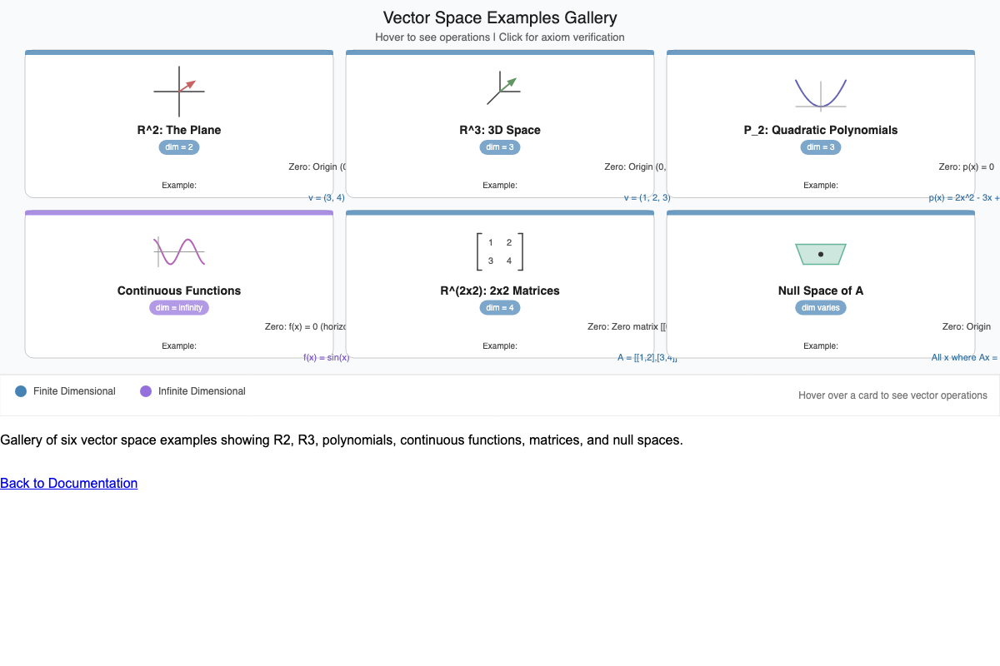
    Interactive gallery showcasing six diverse vector space examples with visual representations, zero vectors, and operation examples.

- **[Subspace Tester](./subspace-tester/index.md)**

    
    Interactive visualization to test whether sets are subspaces by checking closure under linear combinations.

- **[Inner Product Visualizer](./inner-product-visualizer/index.md)**

    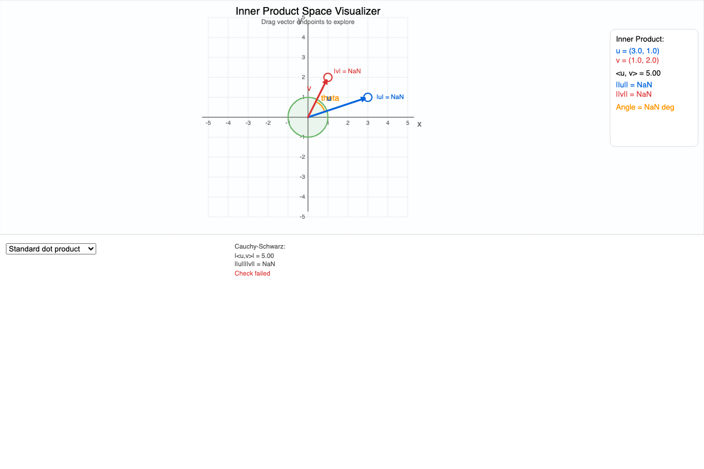
    Interactive visualization showing how different inner products define different notions of length and angle.

## Matrices

- **[Matrix Basic Operations](./matrix-basic-ops/index.md)**

    
    Interactive visualization demonstrating element-wise matrix addition and scalar multiplication with step-by-step calculation highlighting.

- **[Matrix Multiplication](./matrix-multiplication/index.md)**

    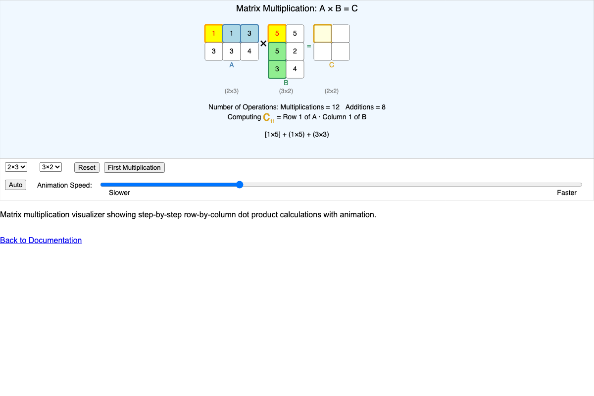
    Step-by-step visualization of matrix multiplication showing row-by-column dot product calculations with animation and highlighting.

- **[Matrix Inverse](./matrix-inverse/index.md)**

    
    Interactive exploration of 2×2 matrix inversion with real-time computation, verification that AA⁻¹ = I, and visualization of singular matrices.

- **[Special Matrices](./special-matrices/index.md)**

    
    Visual gallery of special matrix types including identity, diagonal, upper triangular, and lower triangular matrices with interactive size control.

- **[Symmetric Matrix](./symmetric-matrix/index.md)**

    
    Interactive visualization demonstrating symmetric matrices where A[i,j] = A[j,i], with adjustable size from 2×2 to 10×10.

- **[Sparse and Dense Matrices](./sparse-dense-matrices/index.md)**

    
    Side-by-side comparison of sparse and dense matrices showing structural differences, storage efficiency, and common sparsity patterns.

- **[Block Matrix](./block-matrix/index.md)**

    
    Interactive visualization of matrix partitioning into blocks with draggable partition lines showing how large matrices can be decomposed into submatrices.

## Systems of Linear Equations

- **[System Geometry](./system-geometry/index.md)**

    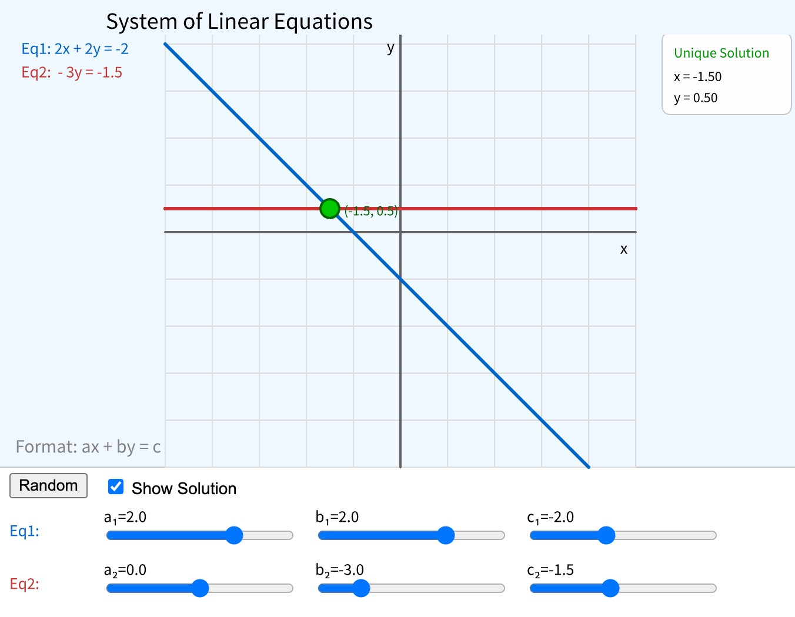
    Interactive visualization showing how systems of linear equations correspond to geometric intersections of lines (2D) or planes (3D).

- **[Gaussian Elimination](./gaussian-elimination/index.md)**

    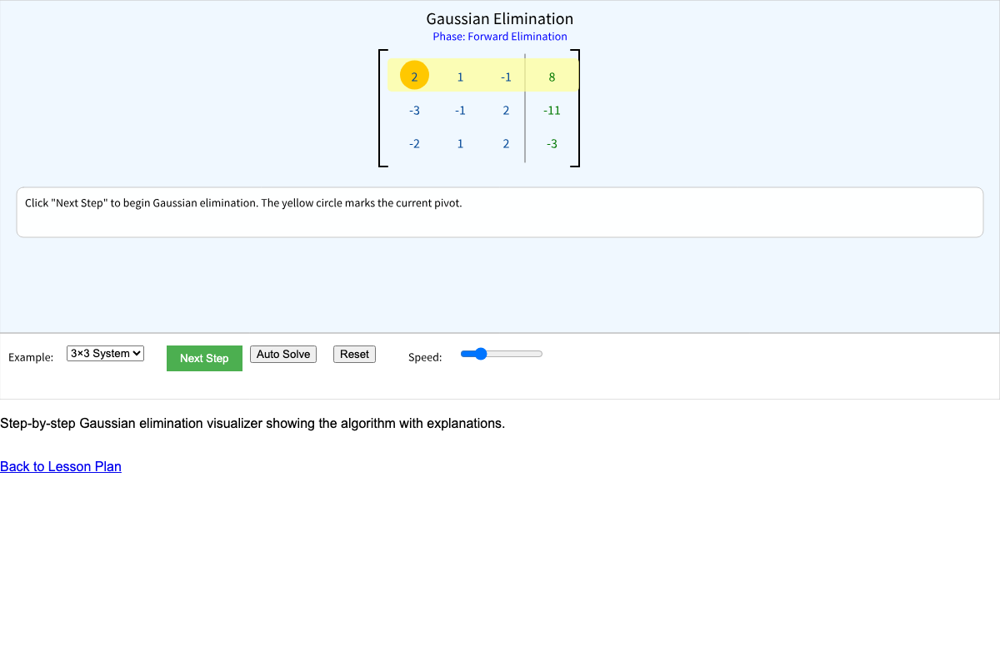
    Step-by-step animated guide through the Gaussian elimination algorithm with explanations.

- **[Row Operations](./row-operations/index.md)**

    
    Interactive practice tool for applying elementary row operations on augmented matrices.

- **[REF vs RREF](./ref-vs-rref/index.md)**

    
    Side-by-side comparison of Row Echelon Form and Reduced Row Echelon Form with highlighted differences.

- **[Solution Sets](./solution-sets/index.md)**

    
    Explore how different systems produce unique solutions, infinite solutions (lines/planes), or no solution.

- **[Homogeneous Systems](./homogeneous-systems/index.md)**

    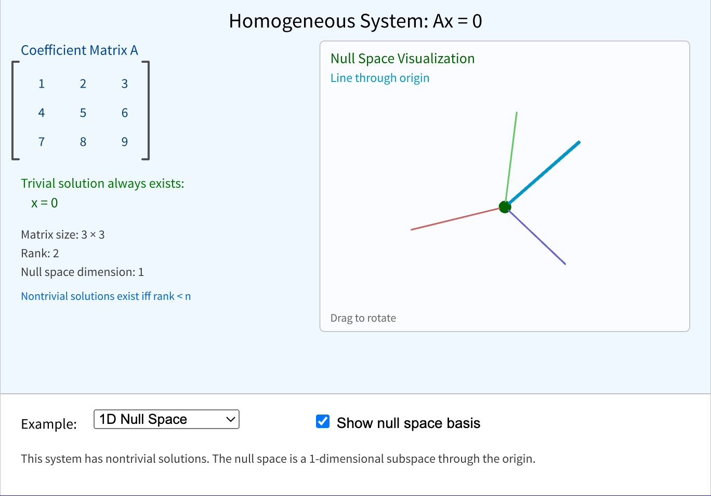
    Explore homogeneous systems Ax = 0 and visualize their null spaces as subspaces through the origin.

- **[Numerical Stability](./numerical-stability/index.md)**

    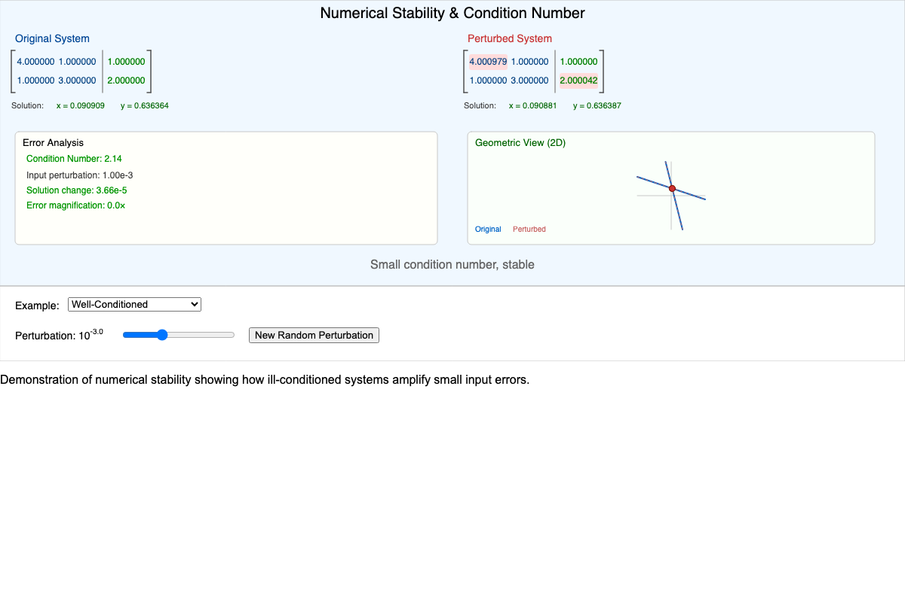
    Explore how ill-conditioned systems amplify small input errors into large solution changes.

## Linear Transformations

- **[Linear Transform Basics](./linear-transform-basics/index.md)**

    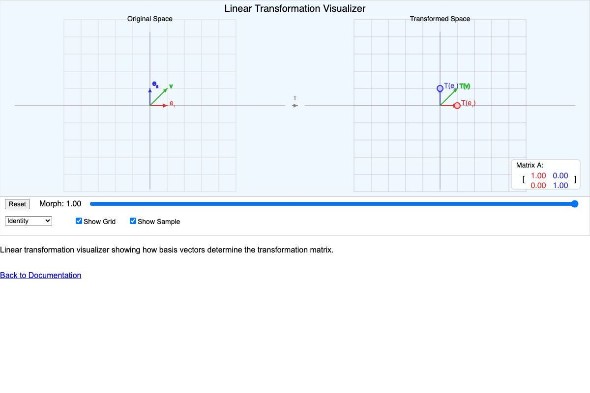
    Interactive visualization showing how linear transformations preserve grid structure and are determined by where basis vectors map.

- **[Transform Gallery](./transform-gallery/index.md)**

    
    Compare and contrast rotation, scaling, shear, and reflection transformations with interactive controls and live matrix display.

- **[Transform Composition](./transform-composition/index.md)**

    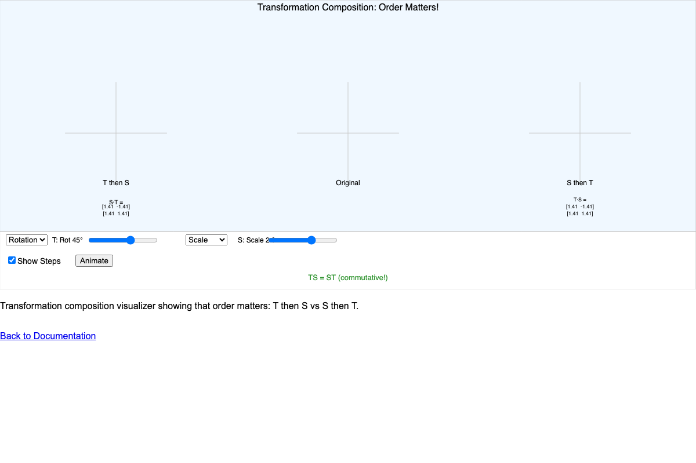
    Demonstrate that the order of transformations matters by comparing T then S versus S then T side by side.

- **[2D Rotation](./2d-rotation/index.md)**

    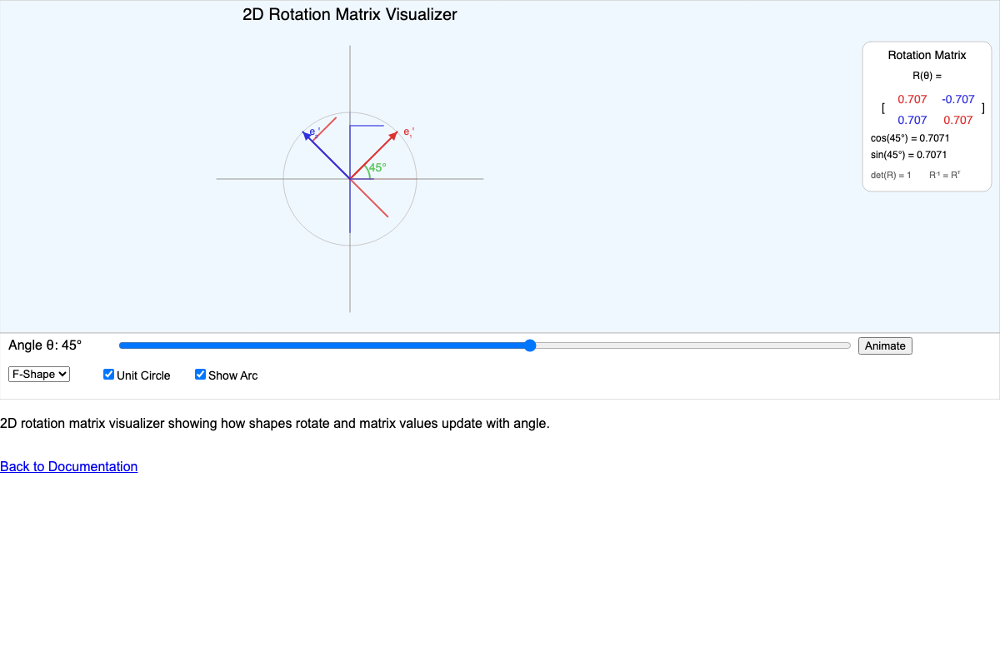
    Interactive visualization of 2D rotation matrices showing the relationship between rotation angle and cos/sin matrix entries.

- **[Orthogonal Transform](./orthogonal-transform/index.md)**

    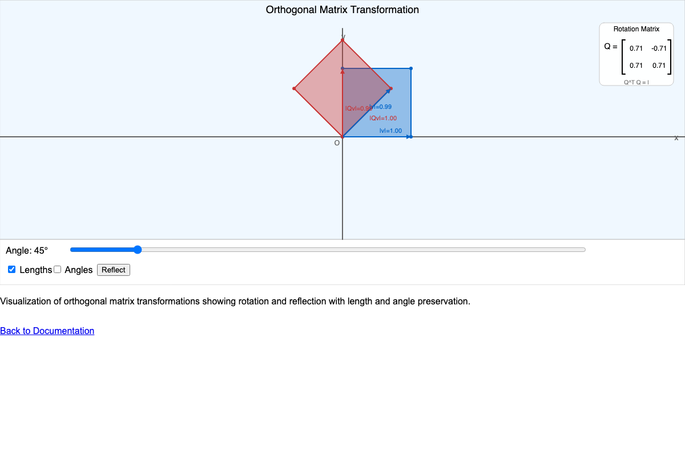
    Interactive visualization demonstrating how orthogonal matrices (rotations and reflections) preserve lengths and angles when transforming shapes.

- **[Orthogonal Projection](./orthogonal-projection/index.md)**

    
    Visualize how vectors project onto lines with perpendicular error vectors and live formula display.

- **[Kernel and Range](./kernel-range/index.md)**

    
    Visualize the kernel (null space) and range (column space) of linear transformations, demonstrating the rank-nullity theorem.

- **[Change of Basis](./change-of-basis/index.md)**

    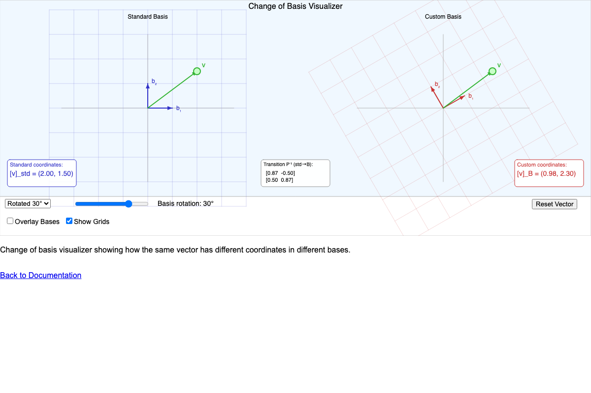
    Visualize how the same vector has different coordinate representations in different bases, with transition matrix display.

- **[Basis Coordinate Visualizer](./basis-coordinate-visualizer/index.md)**

    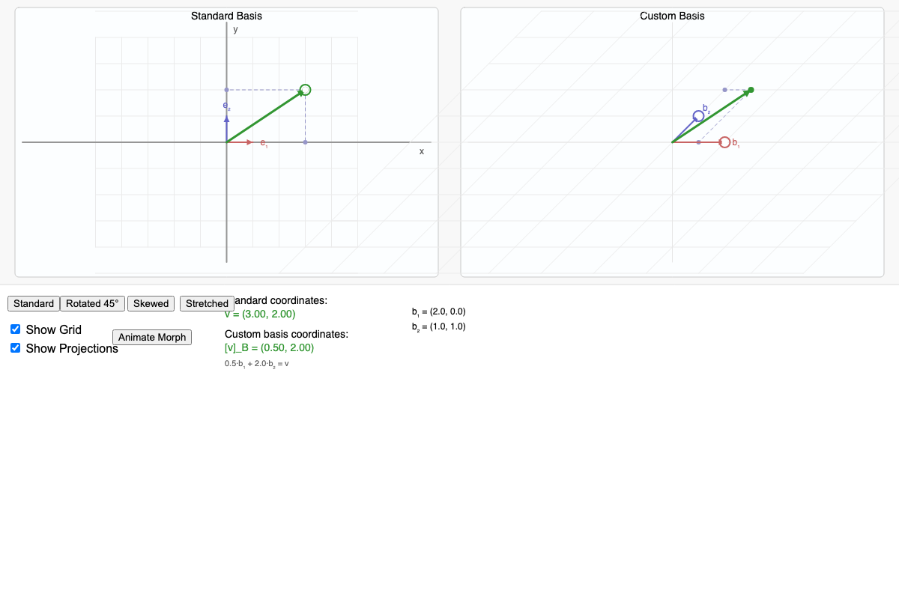
    Side-by-side comparison of standard and custom basis coordinate systems showing how the same vector has different coordinate representations.

## Determinants

- **[2×2 Determinant Calculator](./det-2x2-calculator/index.md)**

    
    Interactive calculator for computing 2×2 determinants with step-by-step visualization and geometric interpretation.

- **[Signed Area](./signed-area/index.md)**

    
    Visualize the signed area of a parallelogram formed by two vectors, showing how orientation affects the sign of the determinant.

- **[Sarrus Rule](./sarrus-rule/index.md)**

    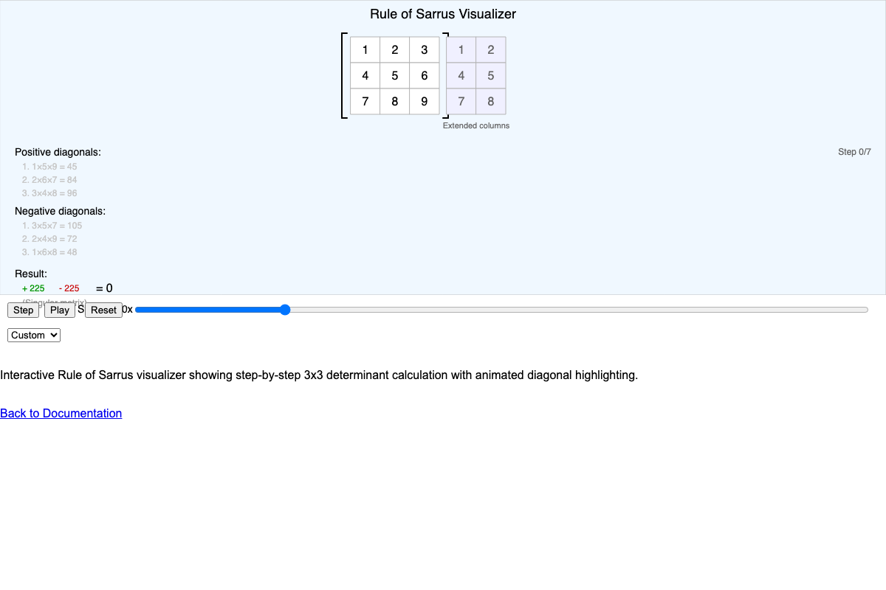
    Step-by-step animation showing how to compute 3×3 determinants using the Rule of Sarrus.

- **[Cofactor Expansion](./cofactor-expansion/index.md)**

    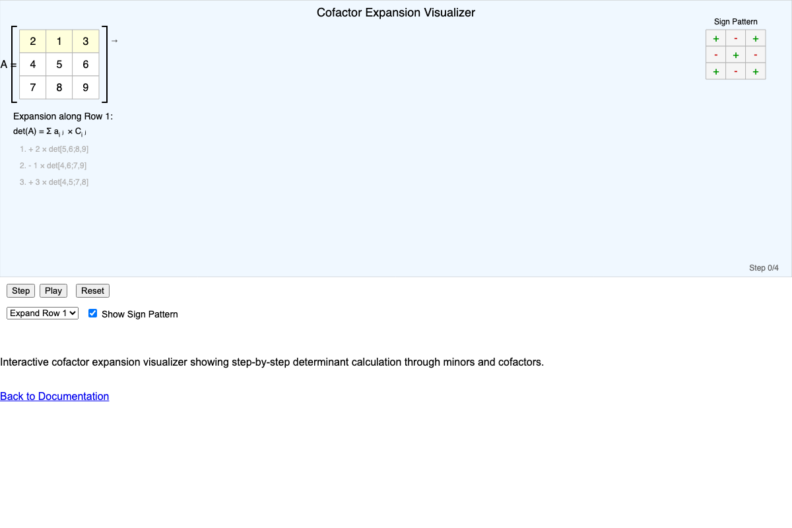
    Step-by-step animation showing cofactor expansion for computing determinants of any size matrix.

- **[Determinant Properties](./det-properties/index.md)**

    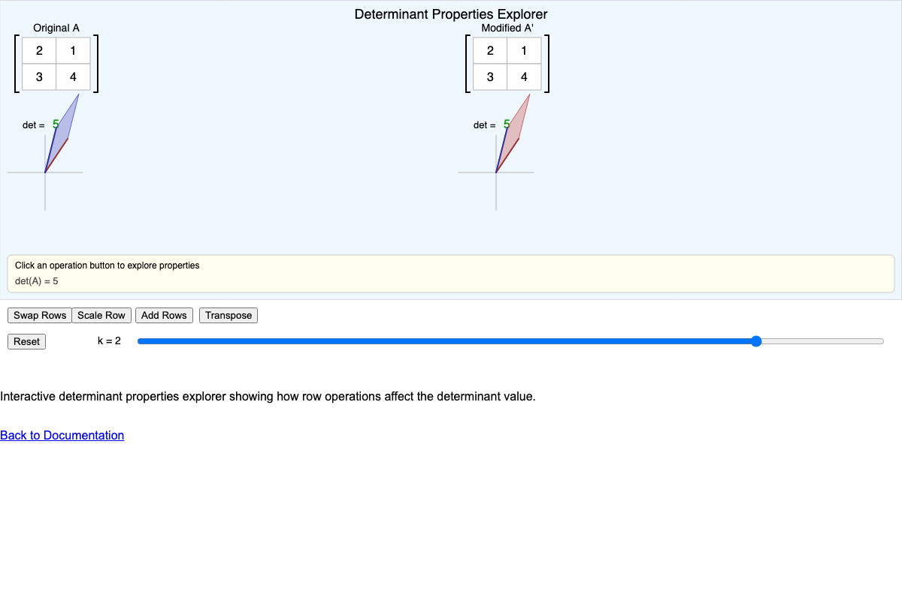
    Interactive exploration of how row operations affect determinant values.

- **[Singular Matrix](./singular-matrix/index.md)**

    
    Visualize the geometric difference between singular and non-singular matrices through transformation animation.

- **[Cramer's Rule](./cramers-rule/index.md)**

    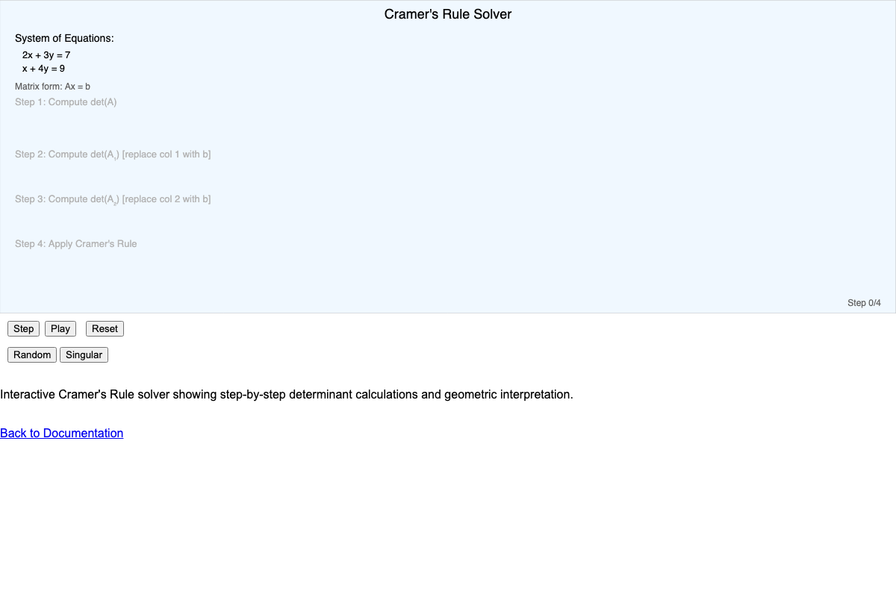
    Step-by-step visualization of solving systems of equations using Cramer's Rule with determinants.

- **[Volume Scaling 3D](./volume-scaling-3d/index.md)**

    
    Visualize how 3×3 matrix transformations scale 3D volumes, connecting the determinant to geometric volume change.

## Eigenvalues and Eigenvectors

- **[Eigenvector Transformation](./eigenvector-transformation/index.md)**

    
    Interactive visualization demonstrating how eigenvectors maintain their direction under linear transformation while other vectors change direction.

- **[Characteristic Polynomial](./characteristic-polynomial/index.md)**

    
    Interactive computation of characteristic polynomials and eigenvalues for 2×2 and 3×3 matrices with graphical visualization.

- **[Eigenspace Visualization](./eigenspace-visualization/index.md)**

    
    3D visualization of eigenspaces showing how geometric multiplicity determines whether eigenspaces are lines or planes through the origin.

- **[Multiplicity Comparison](./multiplicity-comparison/index.md)**

    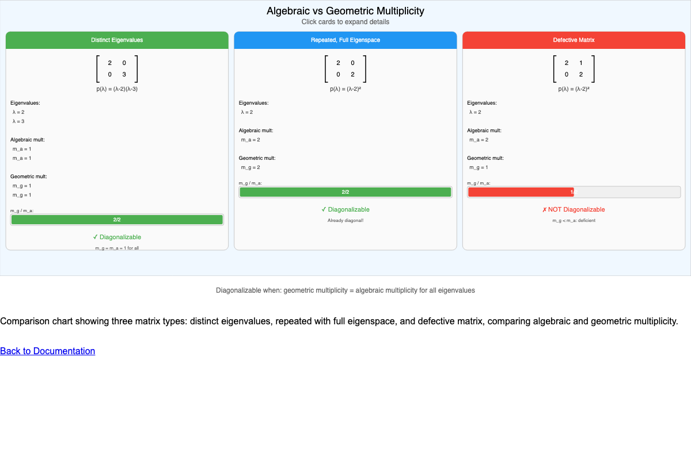
    Compare algebraic and geometric multiplicity across different matrix types to understand diagonalizability conditions.

- **[Diagonalization Workflow](./diagonalization-workflow/index.md)**

    
    Interactive flowchart guiding through the step-by-step process of diagonalizing a matrix with decision points.

- **[Matrix Power Calculator](./matrix-power-calculator/index.md)**

    
    Demonstrates how diagonalization simplifies computing matrix powers using the eigenvalue decomposition A^k = PD^kP⁻¹.

- **[Complex Eigenvalue](./complex-eigenvalue/index.md)**

    
    Visualize how complex eigenvalues λ = a + bi correspond to rotation-scaling transformations in 2D.

- **[Spectral Theorem](./spectral-theorem/index.md)**

    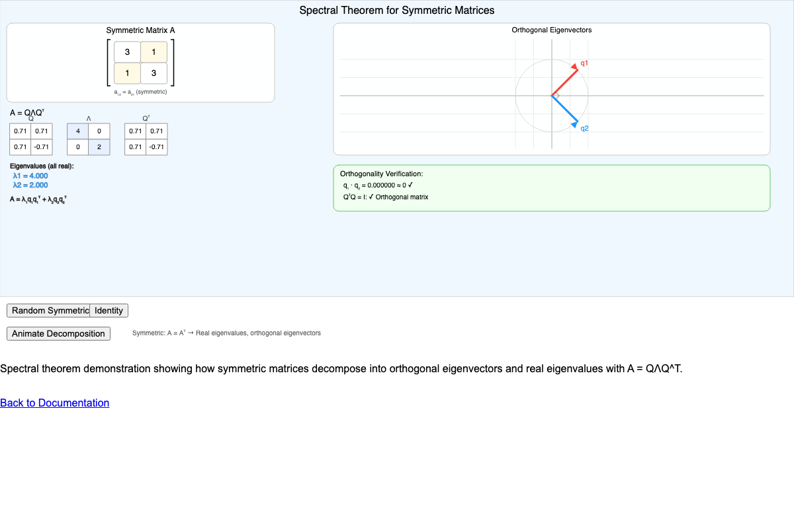
    Interactive demonstration of the spectral theorem showing how symmetric matrices decompose into orthogonal eigenvectors and real eigenvalues.

- **[Power Iteration](./power-iteration/index.md)**

    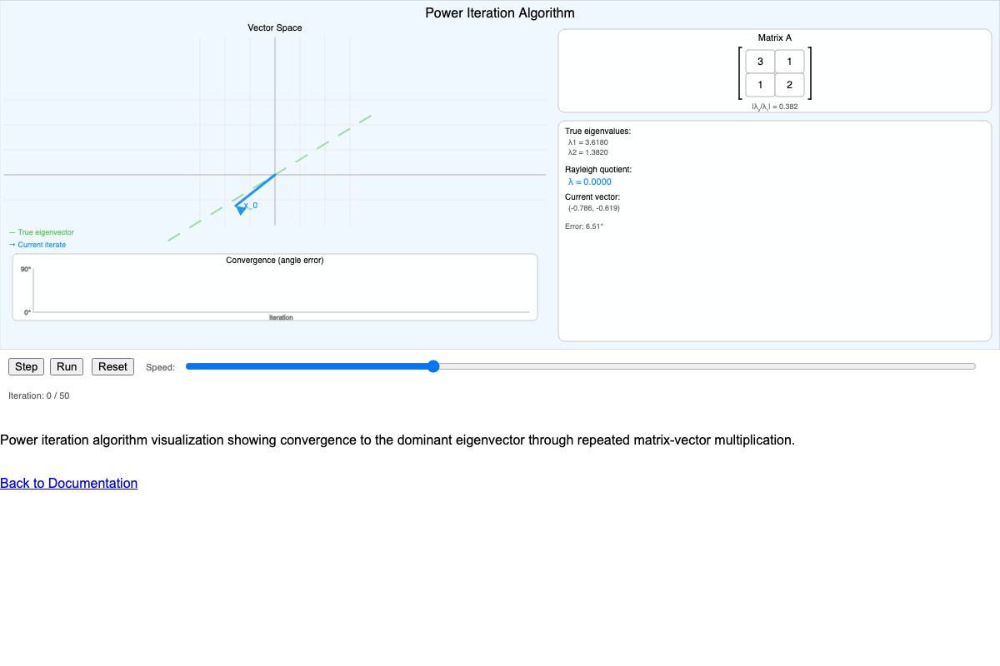
    Visualization of the power iteration method for finding the dominant eigenvalue and eigenvector through repeated matrix-vector multiplication.

- **[Eigenvalue Applications](./eigenvalue-applications/index.md)**

    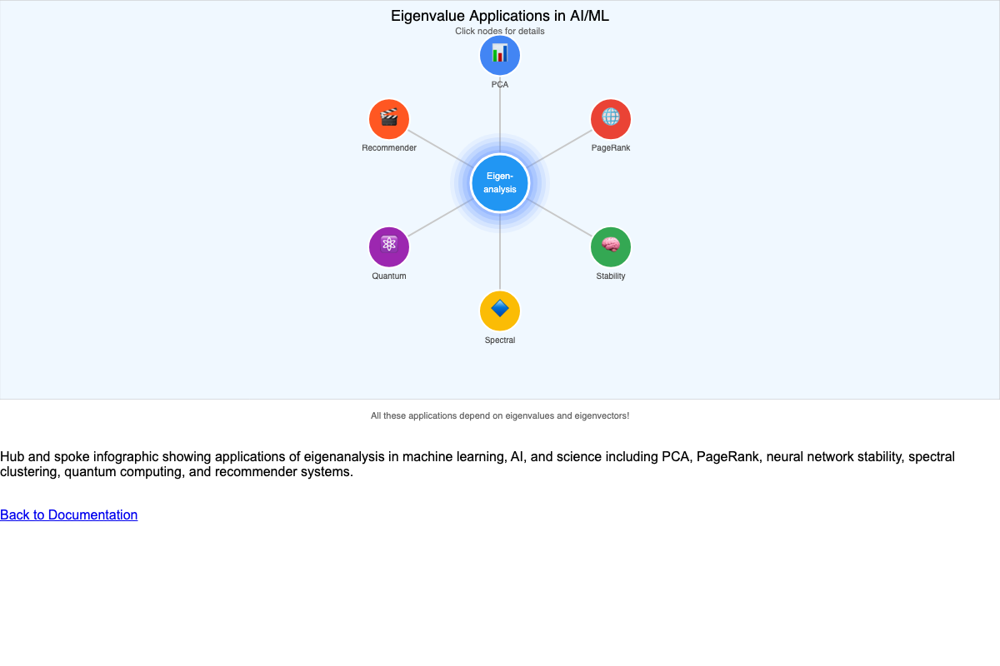
    Interactive hub-and-spoke infographic showing how eigenanalysis concepts connect to real-world applications in machine learning, AI, and science.

## Orthogonality and Least Squares

- **[Gram-Schmidt Process](./gram-schmidt/index.md)**

    
    Step-by-step 3D visualization of Gram-Schmidt orthonormalization showing projections and construction of orthonormal vectors.

- **[Gram-Schmidt (Detailed)](./gram-schmidt-ch8/index.md)**

    
    Detailed step-by-step 3D visualization of Gram-Schmidt orthonormalization showing projection computation, subtraction, and normalization phases.

- **[Orthonormal Basis Finder](./orthonormal-basis-finder/index.md)**

    
    Interactive visualization demonstrating how orthonormal bases simplify coordinate finding through inner products.

- **[Projection onto Subspace](./projection-subspace/index.md)**

    
    3D visualization of vector projection onto subspaces showing the projection as the closest point and the orthogonal error vector.

- **[Least Squares Visualizer](./least-squares-visualizer/index.md)**

    
    Interactive visualization of least squares as projection showing the geometric relationship between b, Ax-hat, and the error vector with dual regression and geometric views.

- **[Four Subspaces](./four-subspaces/index.md)**

    
    Visualize the four fundamental subspaces of a matrix and their orthogonal relationships, demonstrating the Fundamental Theorem of Linear Algebra.

- **[Pseudoinverse Solver](./pseudoinverse-solver/index.md)**

    
    Interactive exploration of the Moore-Penrose pseudoinverse for solving least squares problems, including overdetermined, underdetermined, and rank-deficient systems with SVD visualization.

## Matrix Decompositions

- **[LU Decomposition](./lu-decomposition/index.md)**

    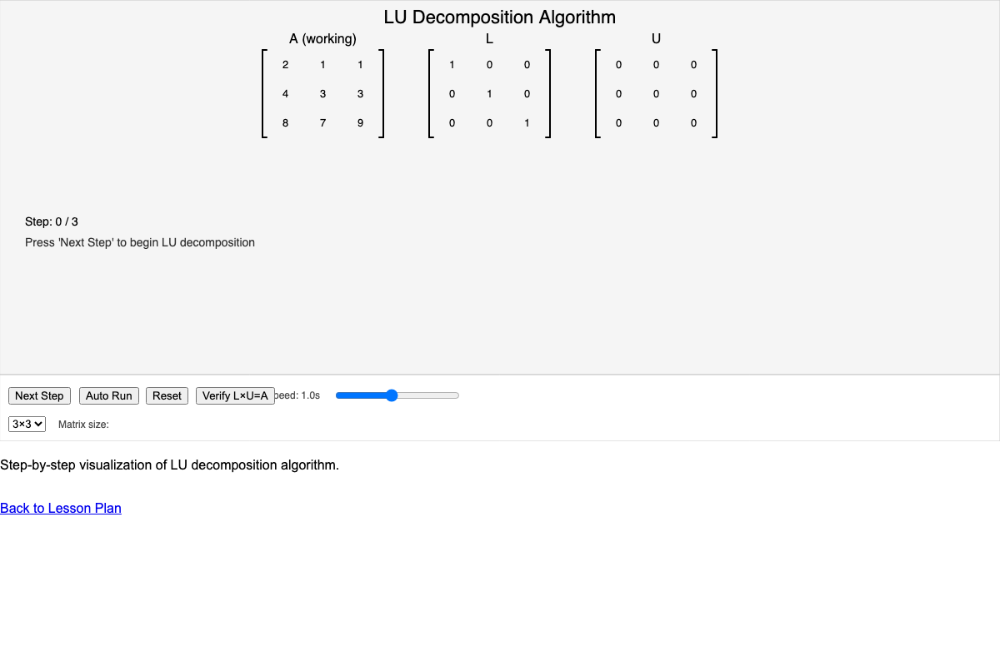
    Step-by-step visualization of LU decomposition showing how Gaussian elimination produces L and U matrices.

- **[Matrix Rank Visualizer](./matrix-rank-visualizer/index.md)**

    
    Interactive 3D visualization showing how matrix rank relates to the column space, with column vectors displayed geometrically and row echelon form computation.

- **[Positive Definiteness](./positive-definiteness/index.md)**

    
    Interactive 3D visualization of quadratic forms showing how eigenvalue signs determine positive definiteness.

- **[SVD Geometry](./svd-geometry/index.md)**

    
    Visualize SVD as a sequence of rotation-scaling-rotation transformations on the unit circle.

- **[SVD Forms Comparison](./svd-forms-comparison/index.md)**

    
    Visual comparison of Full, Compact, and Truncated SVD showing matrix dimensions and storage requirements.

- **[SVD Image Compression](./svd-image-compression/index.md)**

    
    Interactive demonstration of image compression using truncated SVD.

- **[Condition Number](./condition-number/index.md)**

    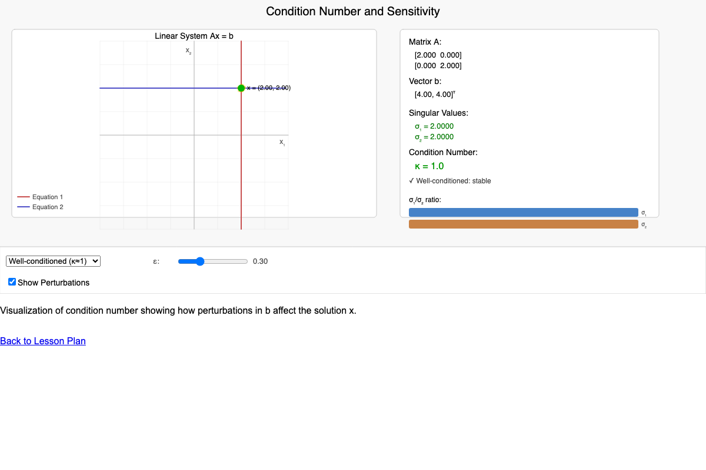
    Visualize how condition number affects the sensitivity of linear system solutions to perturbations.

- **[Decomposition Guide](./decomposition-guide/index.md)**

    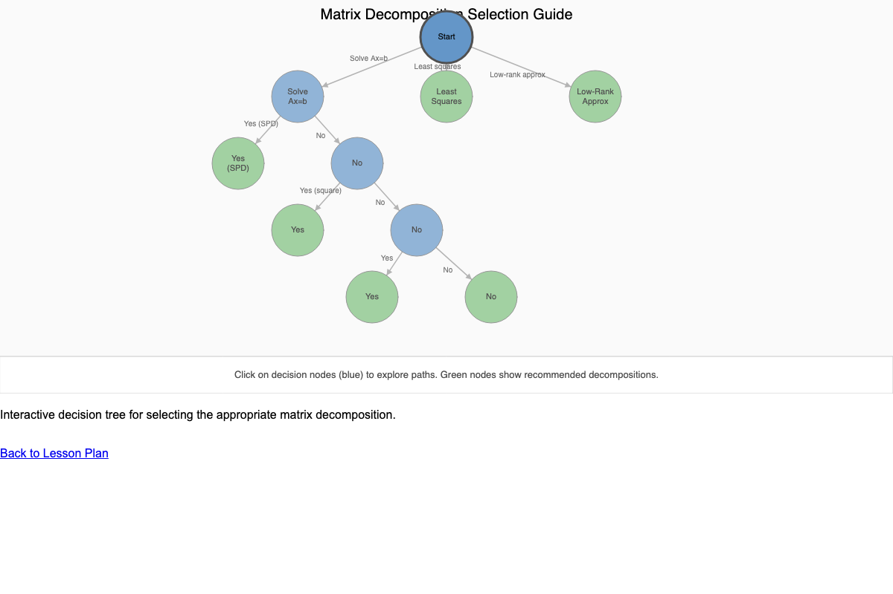
    Interactive decision tree for choosing the right matrix decomposition based on your problem.

## Data Science Applications

- **[Data Matrix Structure](./data-matrix-structure/index.md)**

    
    Interactive visualization showing the structure of data matrices with rows as samples and columns as features, including heat map coloring.

- **[Covariance and Correlation](./covariance-correlation/index.md)**

    
    Interactive exploration of how covariance and correlation capture relationships between features through scatter plots and heatmaps.

- **[PCA Explorer](./pca-explorer/index.md)**

    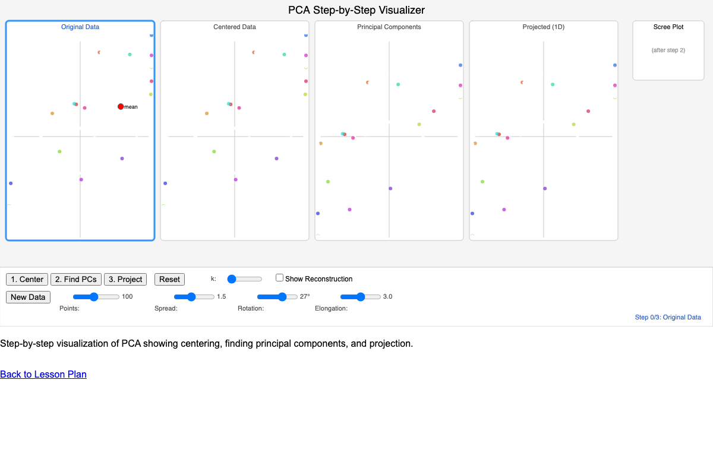
    Interactive visualization demonstrating Principal Component Analysis step by step, from raw data through centering, eigenvector computation, and projection.

- **[Scree Plot](./scree-plot/index.md)**

    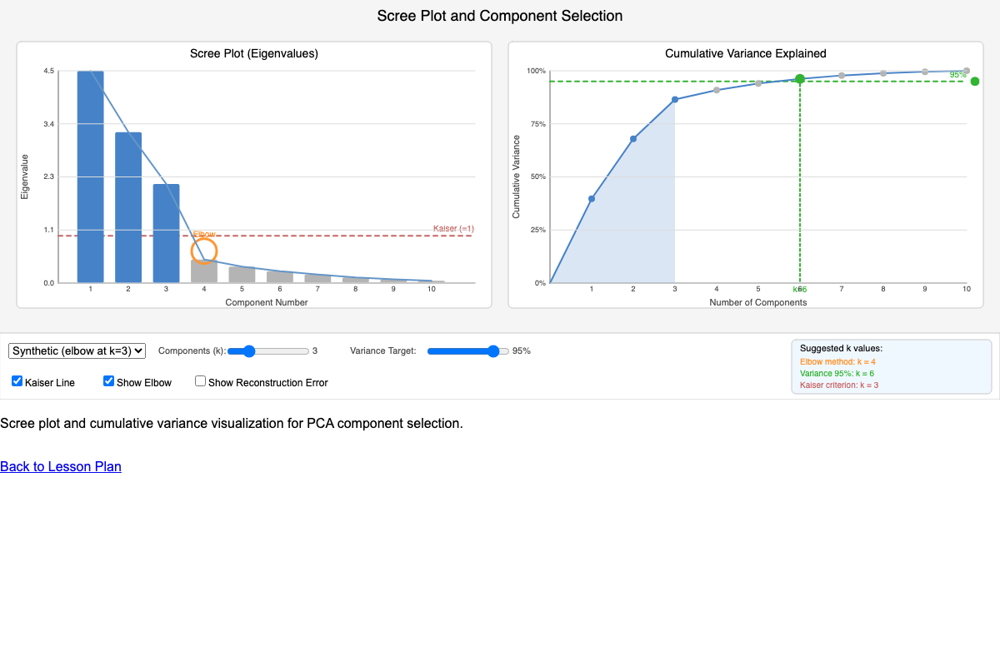
    Interactive visualization for learning to use scree plots and cumulative variance to select the optimal number of principal components.

- **[Linear Regression](./linear-regression/index.md)**

    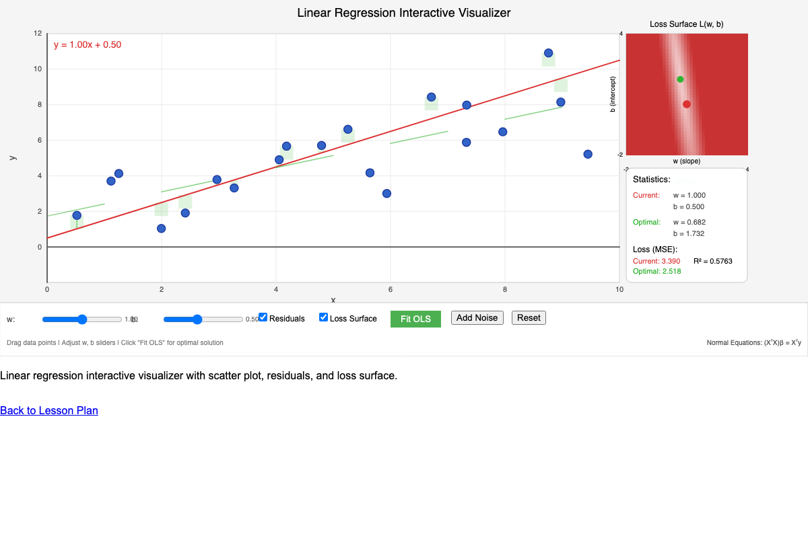
    Interactive visualization of linear regression showing how the best-fit line minimizes squared errors with draggable data points and loss surface heatmap.

- **[Regularization Geometry](./regularization-geometry/index.md)**

    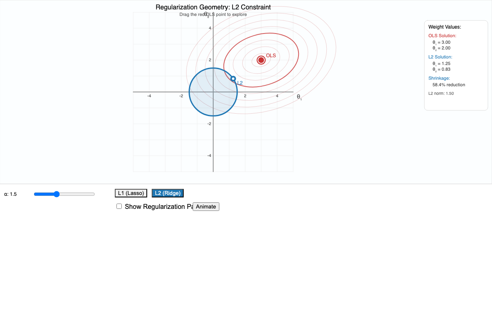
    Interactive visualization showing how L1 and L2 regularization constrain model weights geometrically, demonstrating why L1 produces sparse solutions.

## Neural Networks

- **[Neural Network Layer](./neural-network-layer/index.md)**

    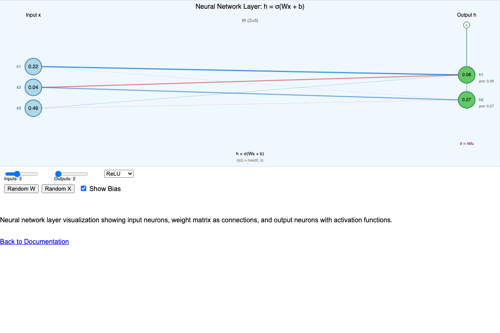
    Interactive visualization of a neural network layer showing how matrix-vector multiplication implements the forward pass with various activation functions.

- **[Neural Network Architecture](./neural-network-architecture/index.md)**

    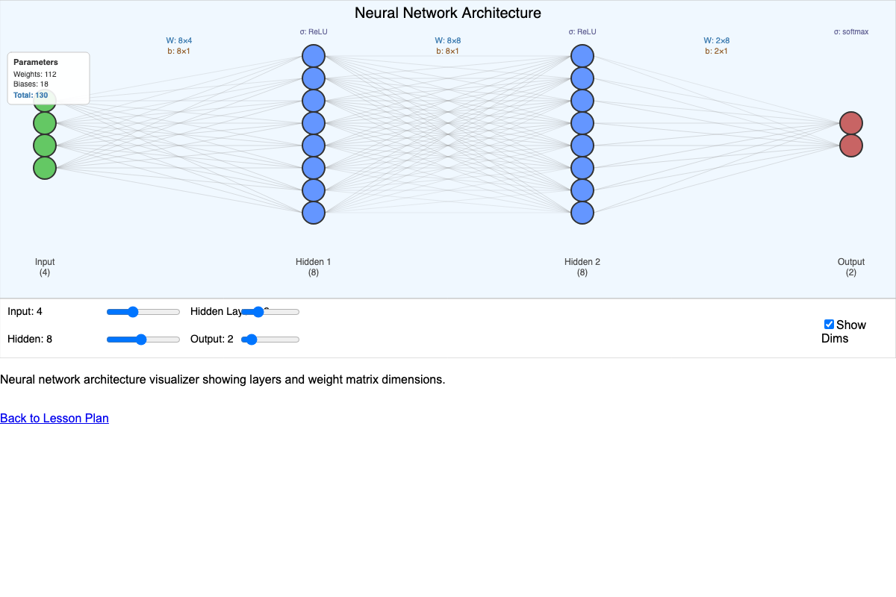
    Interactive visualization of neural network architecture showing layers, neurons, weight matrix dimensions, and parameter counts.

- **[Activation Functions](./activation-functions/index.md)**

    
    Interactive comparison of neural network activation functions including ReLU, Sigmoid, Tanh, Leaky ReLU, and Softplus with derivative visualization.

- **[Perceptron Decision Boundary](./perceptron-decision-boundary/index.md)**

    
    Interactive visualization showing how perceptron weights and bias define a linear decision boundary for binary classification.

- **[Forward Propagation](./forward-propagation/index.md)**

    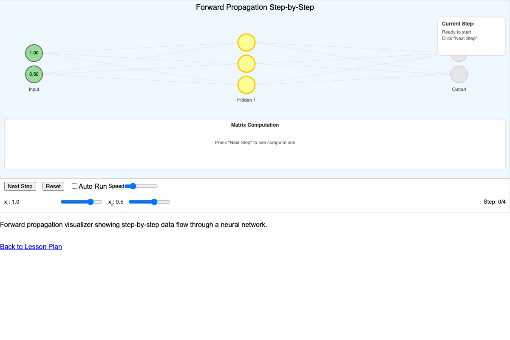
    Step-by-step visualization of forward propagation through a neural network showing matrix operations at each layer.

- **[Backpropagation](./backpropagation/index.md)**

    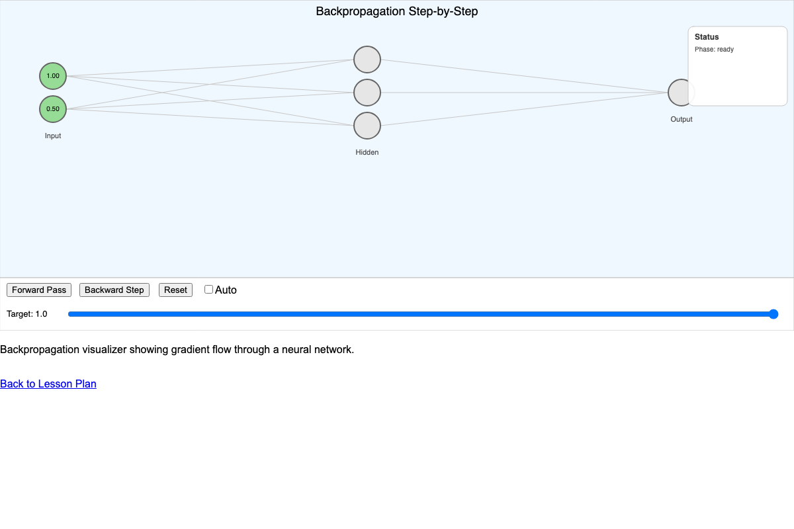
    Step-by-step visualization of backpropagation showing how gradients flow backward through a neural network via the chain rule.

- **[Normalization Comparison](./normalization-comparison/index.md)**

    
    Visual comparison of batch normalization and layer normalization showing which tensor dimensions each technique normalizes.

- **[Tensor Operations](./tensor-operations/index.md)**

    
    Interactive visualization of common tensor operations including reshape, transpose, flatten, squeeze, and unsqueeze.

## Optimization

- **[Gradient Descent](./gradient-descent/index.md)**

    
    Visualize how gradient descent optimization navigates loss surfaces and how learning rate affects convergence behavior.

- **[Learning Rate Effect](./learning-rate-effect/index.md)**

    
    Interactive side-by-side comparison showing how different learning rates affect gradient descent optimization, demonstrating convergence, oscillation, and divergence.

- **[ML Pipeline](./ml-pipeline/index.md)**

    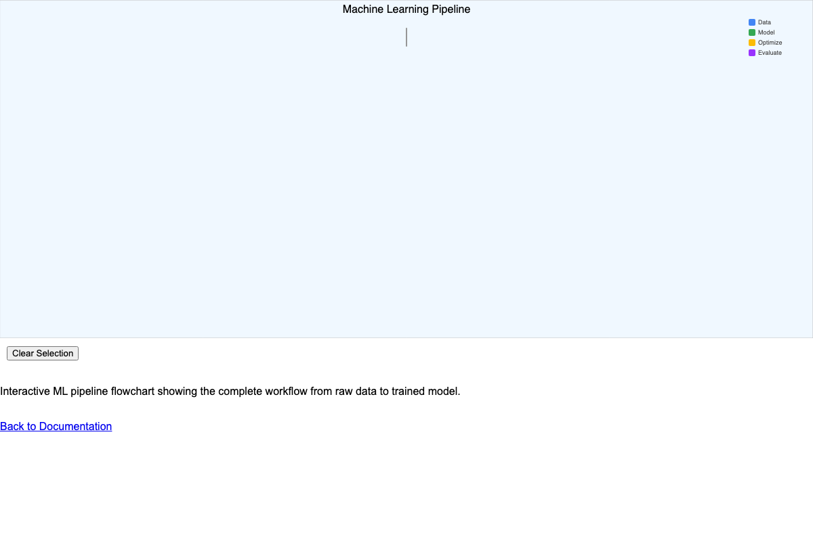
    Interactive flowchart showing the complete ML pipeline from raw data to trained model with code examples and detailed explanations.

- **[Convex Function Visualizer](./convex-function-visualizer/index.md)**

    
    Interactive visualization of convex functions and their properties for optimization.

- **[Newton vs Gradient Descent](./newton-vs-gradient-descent/index.md)**

    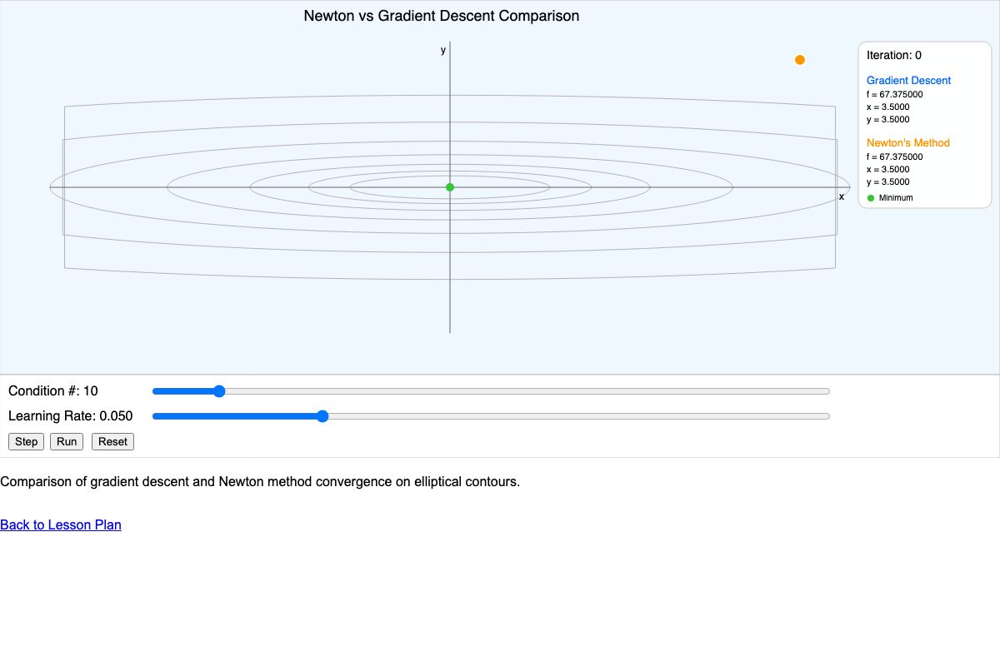
    Side-by-side comparison of Newton's method and gradient descent showing convergence characteristics.

- **[Hessian Curvature Visualizer](./hessian-curvature-visualizer/index.md)**

    
    Interactive visualization of how the Hessian matrix captures surface curvature for optimization.

- **[SGD Trajectory Visualizer](./sgd-trajectory-visualizer/index.md)**

    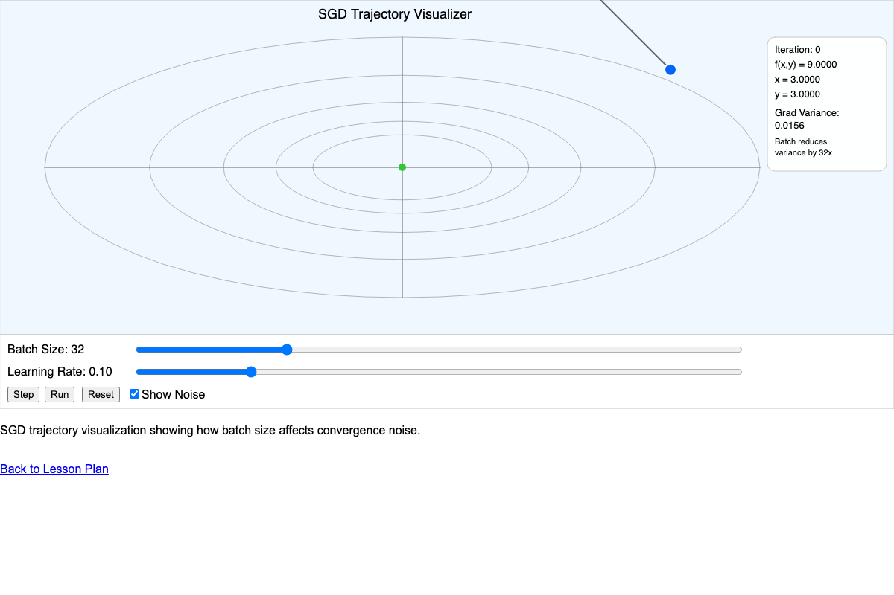
    Visualize stochastic gradient descent trajectories and noise characteristics.

- **[Momentum Dynamics Visualizer](./momentum-dynamics-visualizer/index.md)**

    
    Interactive visualization of momentum in optimization showing how it helps overcome local minima.

- **[Optimizer Comparison Arena](./optimizer-comparison-arena/index.md)**

    
    Compare different optimization algorithms side-by-side on the same loss surface.

- **[Lagrange Multiplier Geometry](./lagrange-multiplier-geometry/index.md)**

    
    Interactive visualization of Lagrange multipliers for constrained optimization.

- **[KKT Conditions Visualizer](./kkt-conditions-visualizer/index.md)**

    
    Visualize the Karush-Kuhn-Tucker conditions for constrained optimization problems.

## Transformers and NLP

- **[Attention Mechanism](./attention-mechanism/index.md)**

    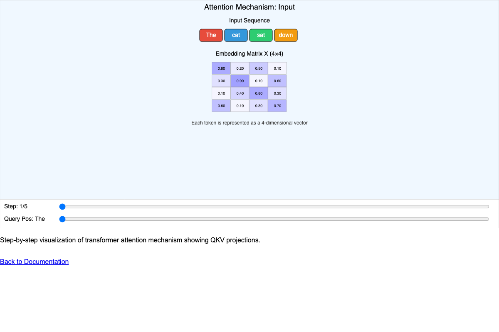
    Interactive visualization of the attention mechanism used in transformer models.

- **[Multi-Head Attention](./multi-head-attention/index.md)**

    
    Visualize how multi-head attention allows the model to attend to different positions simultaneously.

- **[Transformer Block](./transformer-block/index.md)**

    
    Interactive visualization of a complete transformer block showing self-attention and feed-forward layers.

- **[Embedding Space Visualizer](./embedding-space-visualizer/index.md)**

    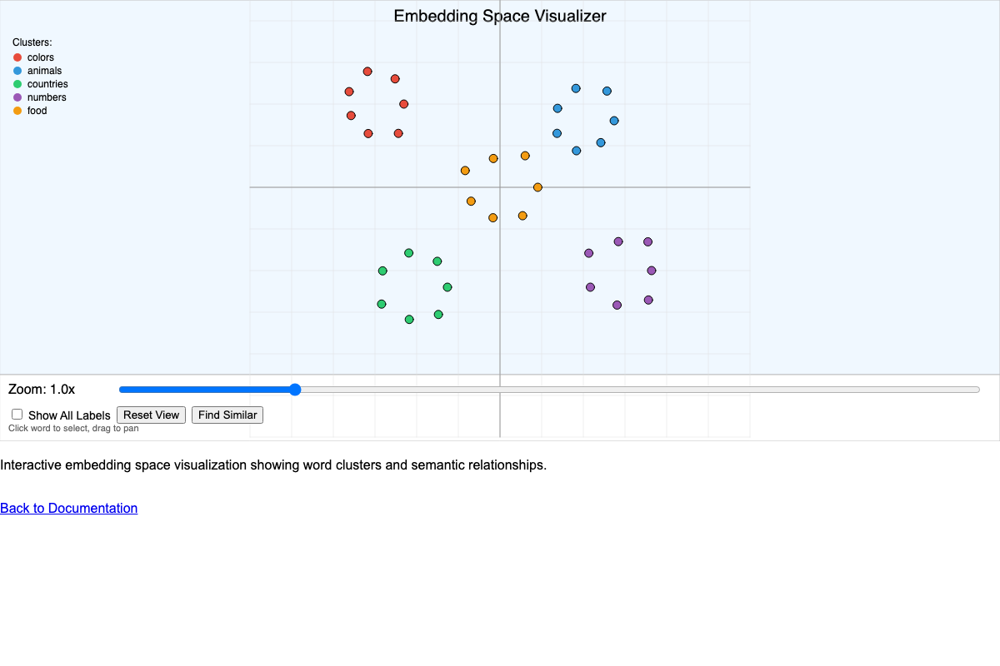
    Explore word and document embeddings in high-dimensional space projected to 2D/3D.

- **[Cosine and Euclidean Similarity](./cosine-euclidean-similarity/index.md)**

    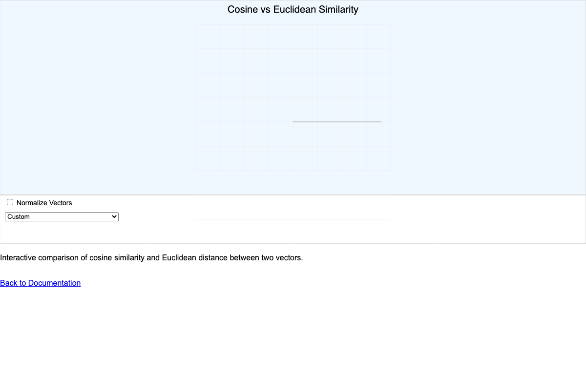
    Compare cosine similarity and Euclidean distance for measuring vector relationships.

- **[LoRA Visualizer](./lora-visualizer/index.md)**

    
    Visualize Low-Rank Adaptation (LoRA) for efficient fine-tuning of large language models.

- **[Latent Space Interpolation](./latent-space-interpolation/index.md)**

    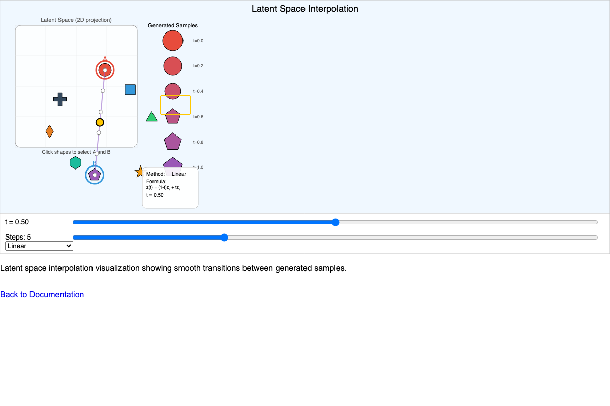
    Explore smooth transitions in latent space by interpolating between embeddings.

## Computer Vision

- **[Image Matrix Visualizer](./image-matrix-visualizer/index.md)**

    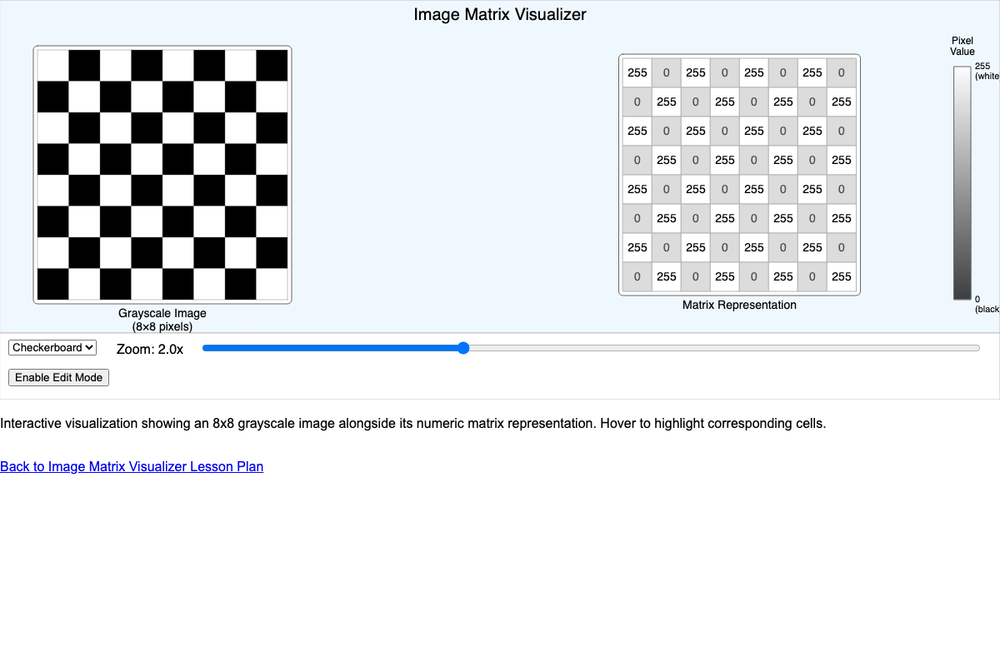
    Interactive visualization showing how pixel values in a matrix correspond to grayscale image appearance with hover highlighting and edit mode.

- **[RGB Channel Decomposition](./rgb-channel-decomposition/index.md)**

    
    Interactive visualization showing how RGB color channels combine to form color images with channel isolation and intensity controls.

- **[Convolution Operation](./convolution-operation/index.md)**

    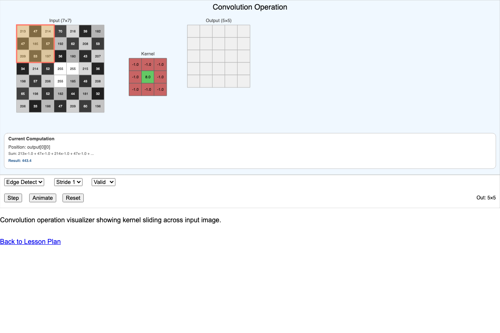
    Interactive visualization of the convolution operation showing how kernels slide across images with stride and padding controls.

- **[Convolution Visualizer](./convolution-visualizer/index.md)**

    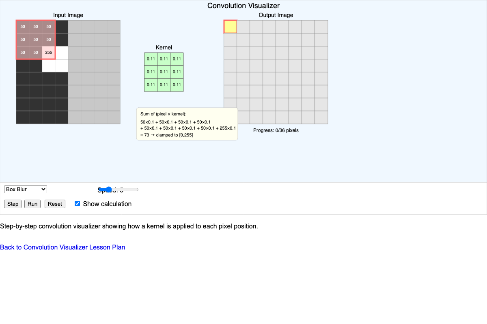
    Step-by-step visualization of image convolution showing how kernels slide across images to compute filtered outputs with multiple kernel types.

- **[Filter Effects Gallery](./filter-effects-gallery/index.md)**

    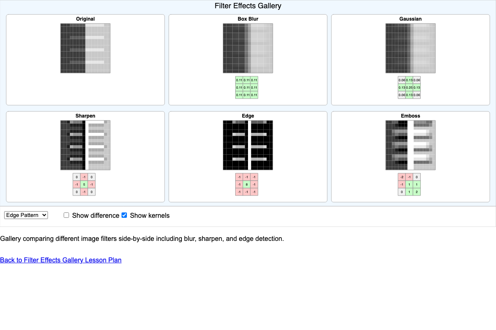
    Side-by-side comparison of image filters including blur, sharpen, edge detection, and emboss effects with kernel visualization.

- **[Edge Detection Visualizer](./edge-detection-visualizer/index.md)**

    
    Interactive visualization of Sobel, Prewitt, and Scharr edge detection operators showing gradient components, magnitude, and thresholded edges.

- **[Corner Detection Visualizer](./corner-detection-visualizer/index.md)**

    
    Interactive Harris corner detection visualization showing structure tensor eigenvalue analysis and response heatmaps.

- **[Fourier Transform Visualizer](./fourier-transform-visualizer/index.md)**

    
    Interactive 2D Discrete Fourier Transform visualization showing spatial-frequency relationship, magnitude/phase spectra, and frequency filtering.

- **[Homography Demo](./homography-demo/index.md)**

    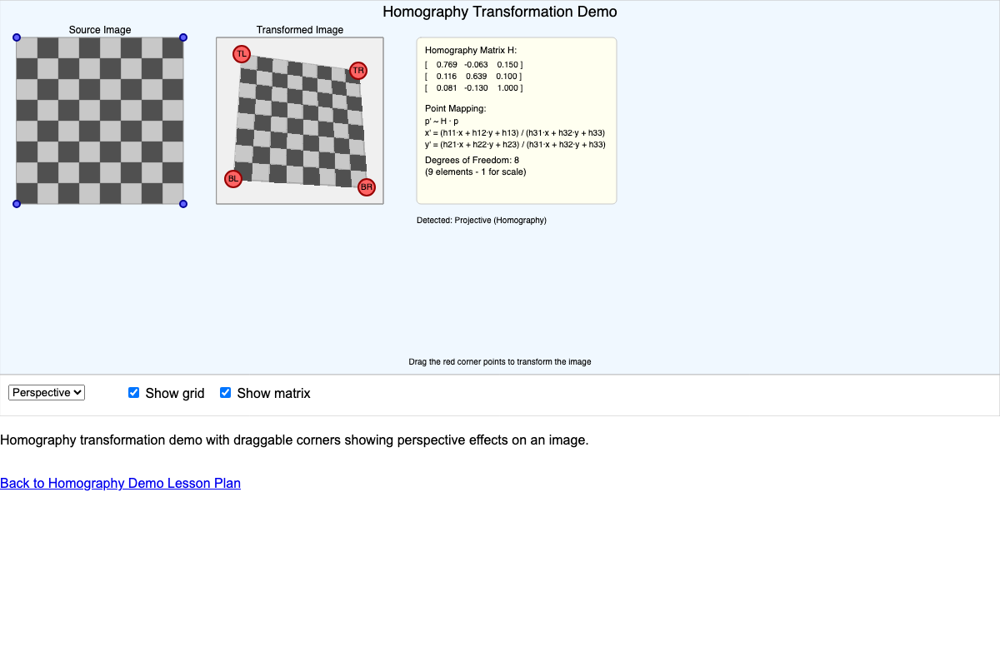
    Interactive demonstration of perspective transformations using homography matrices with draggable corner points and real-time matrix computation.

- **[SVD Compression Visualizer](./svd-compression-visualizer/index.md)**

    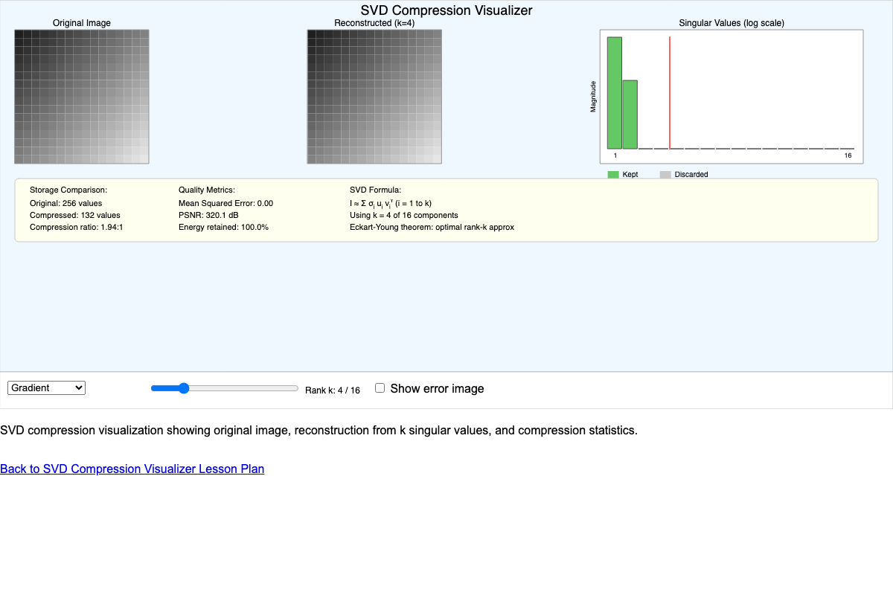
    Interactive demonstration of image compression using truncated Singular Value Decomposition with quality metrics.

## 3D Vision and Geometry

- **[Camera Model Visualizer](./camera-model-visualizer/index.md)**

    
    Interactive demonstration of the pinhole camera model showing how intrinsic parameters affect 3D-to-2D projection.

- **[Camera Calibration](./camera-calibration/index.md)**

    
    Interactive demonstration of camera calibration showing lens distortion effects, checkerboard corner detection, and distortion correction.

- **[Epipolar Geometry](./epipolar-geometry/index.md)**

    
    Interactive demonstration of epipolar constraints in stereo vision showing epipolar lines, planes, and depth from disparity.

- **[Triangulation Visualizer](./triangulation-visualizer/index.md)**

    
    Interactive demonstration of 3D point recovery from stereo correspondences showing triangulation accuracy and noise effects.

- **[Point Cloud Visualizer](./point-cloud-visualizer/index.md)**

    
    Interactive exploration of point cloud data with different datasets, color modes, downsampling, and surface normal visualization.

## Autonomous Systems

- **[Coordinate System 3D](./coordinate-system-3d/index.md)**

    
    Interactive demonstration of different 3D coordinate system conventions and handedness including OpenGL, DirectX, ROS, and camera frames.

- **[Euler Angles Visualizer](./euler-angles-visualizer/index.md)**

    
    Interactive demonstration of how Euler angles (yaw, pitch, roll) compose to form 3D rotations with multiple conventions and gimbal lock warning.

- **[Gimbal Lock Demo](./gimbal-lock-demo/index.md)**

    
    Interactive demonstration of gimbal lock using a physical gimbal mechanism with three nested rings showing loss of degree of freedom.

- **[Quaternion Rotation](./quaternion-rotation/index.md)**

    
    Interactive demonstration of quaternion rotation representation with axis-angle conversion, rotation application, and composition.

- **[Rigid Body Transform](./rigid-body-transform/index.md)**

    
    Interactive visualization of rigid body transform composition in a robot arm kinematic chain showing forward kinematics.

- **[Kalman Filter](./kalman-filter/index.md)**

    
    Interactive visualization of the Kalman filter showing the predict-update cycle, uncertainty propagation, and noise effects on state estimation.

- **[Sensor Fusion](./sensor-fusion/index.md)**

    
    Interactive demonstration of GPS and IMU sensor fusion using Kalman filtering, showing how combining complementary sensors improves accuracy.

- **[LIDAR Point Cloud](./lidar-point-cloud/index.md)**

    
    Interactive 3D visualization of LIDAR point cloud data demonstrating ground segmentation, object clustering, and coloring modes.

- **[SLAM Visualizer](./slam-visualizer/index.md)**

    
    Interactive visualization of Simultaneous Localization and Mapping showing robot trajectory, landmark mapping, and loop closure optimization.

- **[Object Tracking](./object-tracking/index.md)**

    
    Interactive multi-object tracking demonstration showing the predict-associate-update cycle with bounding boxes, track IDs, and data association.

- **[Path Planning](./path-planning/index.md)**

    
    Interactive comparison of path planning algorithms (A*, Dijkstra, RRT) showing exploration patterns, path quality, and performance metrics.

- **[Trajectory Optimization](./trajectory-optimization/index.md)**

    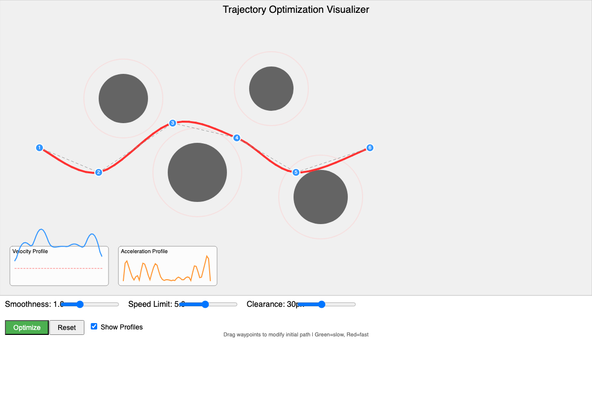
    Interactive trajectory optimization demonstration showing smoothness constraints, velocity limits, obstacle avoidance, and cost convergence.

## Learning Tools

- **[Learning Graph Viewer](./graph-viewer/index.md)**

    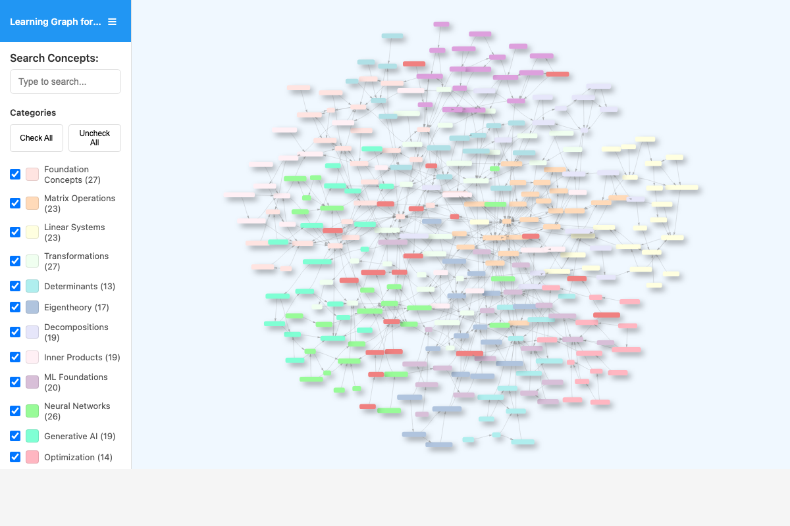
    Interactive visualization of the course concept dependency graph with 300 concepts and their relationships.

